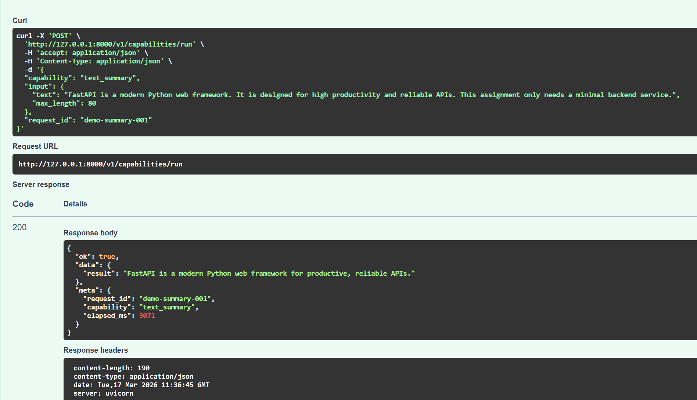
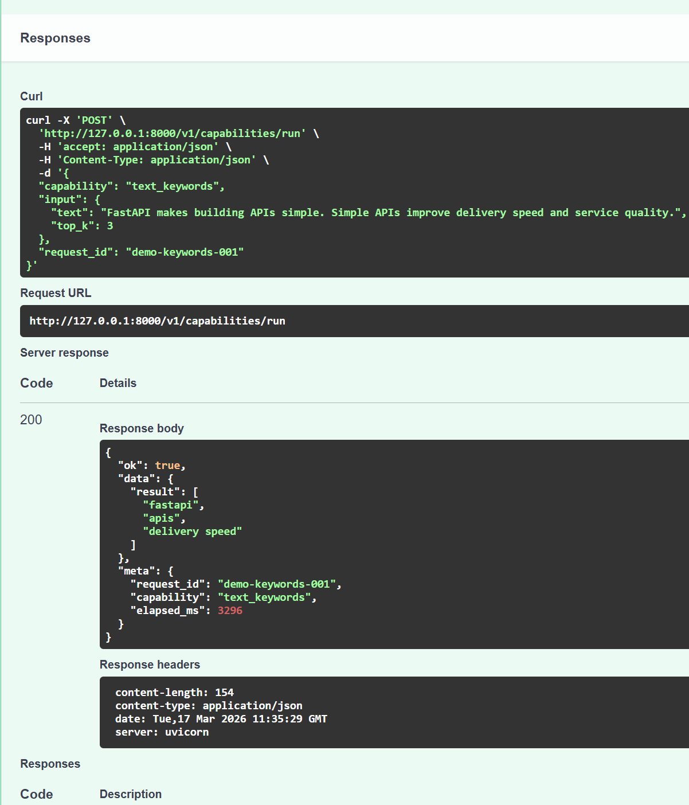
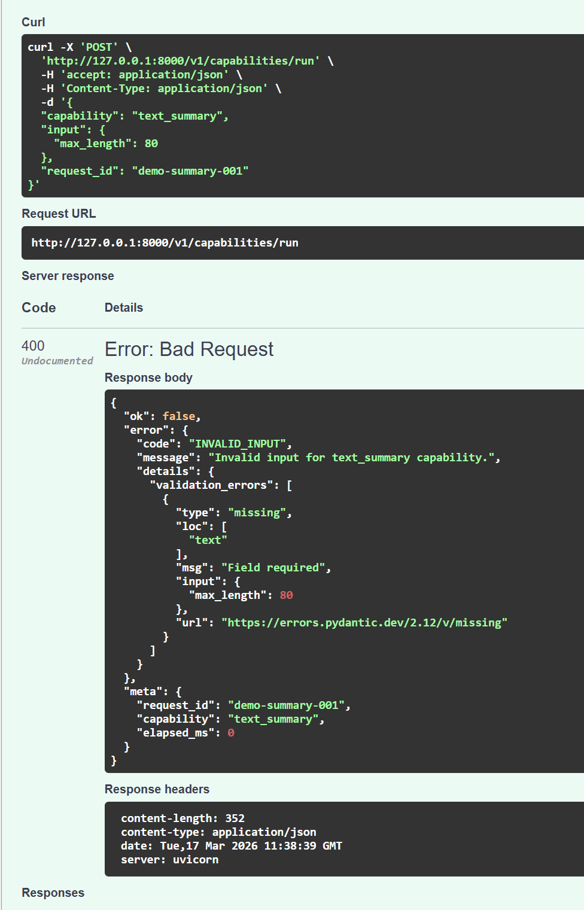

# AI Capability Service

一个最小但可直接运行的统一模型能力调用后端服务，按题目要求实现：

- `POST /v1/capabilities/run`
- `text_summary` capability
- 统一成功/失败响应结构
- 请求 ID、耗时统计、基础日志
- 最小测试
- 额外实现一个 `text_keywords` capability

## 运行要求

- Python 3.11+

## 安装依赖

```bash
python -m venv .venv
.venv\Scripts\activate
pip install -r requirements.txt
```

## 环境变量

项目使用真实的 OpenAI-compatible API（通过 `openai` SDK 调用）。

`.env` 需要至少包含：

```env
AI_API_KEY=your_api_key
AI_BASE_URL=https://your-openai-compatible-endpoint/v1
AI_MODEL=gpt-4.1
```

说明：为了方便评审与完整联调测试，本仓库没有隐藏 `.env` 文件。

## 启动服务

```bash
uvicorn app.main:app --host 0.0.0.0 --port 8000 --reload
```

服务启动后可访问：

- `http://127.0.0.1:8000/health`
- `http://127.0.0.1:8000/docs`  推荐，可以直接使用预定义参数测试api
### summary功能

### 关键词提取功能

### 错误请求示例(缺失字段)


## 示例请求

### 1. 文本摘要

```bash
curl -X POST http://127.0.0.1:8000/v1/capabilities/run \
  -H "Content-Type: application/json" \
  -d '{
    "capability": "text_summary",
    "input": {
      "text": "FastAPI is a modern Python web framework. It is designed for high productivity and reliable APIs. This assignment only needs a minimal backend service.",
      "max_length": 80
    },
    "request_id": "demo-summary-001"
  }'
```

### 2. 关键词提取

```bash
curl -X POST http://127.0.0.1:8000/v1/capabilities/run \
  -H "Content-Type: application/json" \
  -d '{
    "capability": "text_keywords",
    "input": {
      "text": "FastAPI makes building APIs simple. Simple APIs improve delivery speed and service quality.",
      "top_k": 3
    }
  }'
```

## 运行测试

```bash
pytest
```

## CI

已配置 GitHub Actions：

- `push` 到 `main` 
- 任意 `pull_request`

都会自动安装依赖并执行 `pytest -q` 实现自动化测试。

## 设计说明

- 使用 FastAPI + Pydantic 实现输入校验与 HTTP 服务
- 通过 capability registry 做能力分发，方便继续扩展更多能力
- 统一返回 `ok/data/meta` 或 `ok/error/meta`
- 对业务异常和校验异常分别处理，输出稳定的错误码
- 使用真实模型 API 完成 `text_summary` 与 `text_keywords` 能力
